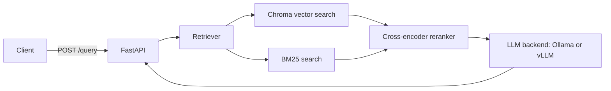

# RAG Web App

A local retrieval-augmented generation (RAG) API built with FastAPI. It
indexes the BEIR `nfcorpus` dataset in Chroma, retrieves and reranks relevant
passages, and asks a locally served model to generate an answer through a
pluggable backend (Ollama or vLLM). Each query response also includes the
passages used as sources.

## How it works



By default, the application uses hybrid retrieval:

1. Chroma retrieves semantically similar chunks using
   `mixedbread-ai/mxbai-embed-large-v1` embeddings.
2. BM25 retrieves keyword-matched chunks from the same collection.
3. Reciprocal-rank fusion combines both result sets.
4. `BAAI/bge-reranker-v2-m3` reranks the candidates and keeps the best three
   distinct source documents.
5. The selected content is supplied to the configured LLM backend
   (`llama3.1` on Ollama by default).

The vector database is created automatically on the first application start.
The build downloads `nfcorpus`, splits its documents into 2,048-character
chunks with 300-character overlap, and stores 512-dimensional normalized
embeddings in `vectordatabase/`.

## Requirements

- Python 3.12+
- [uv](https://docs.astral.sh/uv/)
- A generation backend: Ollama or vLLM, both supplied as Compose services
- Docker Desktop with Compose

An NVIDIA GPU is optional for Ollama but effectively required for vLLM. The
supplied Compose configuration requests one for every service; remove the
`deploy.resources.reservations.devices` blocks from `docker-compose.yml` when
running without NVIDIA GPU support.

## LLM backend

Answer generation goes through the `LLMClient` protocol in `src/model.py`,
so which backend serves the model is a configuration choice rather than a code
change. Configure it with environment variables:

| Variable | Default | Description |
| --- | --- | --- |
| `LLM_BACKEND` | `ollama` | Chat backend to use: `ollama` or `vllm`. |
| `LLM_BASE_URL` | per backend | `http://localhost:11434` for `ollama`, `http://localhost:8000` for `vllm`. |
| `LLM_TIMEOUT` | `120` | Request timeout in seconds. |
| `GENERATE_MODEL` | per backend | `llama3.1` for `ollama`, `Qwen/Qwen2.5-1.5B-Instruct` for `vllm`. |
| `LLM_API_KEY` | `EMPTY` | Only used by `vllm`, and only if it was started with `--api-key`. |

The client is built during app startup, so an unknown `LLM_BACKEND` fails the
boot with a `ValueError` listing the accepted values rather than failing the
first query.

The two backends name models differently: Ollama uses its own tags
(`llama3.1`), vLLM uses the Hugging Face repo id it was launched with
(`Qwen/Qwen2.5-1.5B-Instruct`). `src/config.py` picks the right default per
backend, so `GENERATE_MODEL` only needs setting when you want a different
model.

## Run locally

Install the Python dependencies:

```bash
make install
```

Then start a backend container and the API with hot reload in one step —
Ollama by default:

```bash
make ollama
```

Or with vLLM:

```bash
make vllm
```

| Step | `make ollama` | `make vllm` |
| --- | --- | --- |
| Start the container | `--profile ollama up -d ollama` | `--profile vllm up -d vllm` |
| Wait until ready | poll `localhost:11434` | poll `localhost:8001/health` |
| Fetch the model | `ollama pull llama3.1` | downloaded on first serve |
| Serve the app | `uvicorn --reload` on `localhost:8000` | same |

The API is available at `http://localhost:8000`. On the first start, model
downloads and vector-database construction can take several minutes.

To serve a different model, set `GENERATE_MODEL` on the same line:

```bash
GENERATE_MODEL=Qwen/Qwen2.5-1.5B-Instruct make vllm
```

`GENERATE_MODEL` is read by the app and, on the vLLM profile, by the `vllm`
service itself, so setting it once keeps the client and the server on the same
model; on the Ollama line it also selects what `ollama pull` fetches. Set
`HF_TOKEN` as well for gated Hugging Face repos such as `meta-llama/*` —
without it vLLM fails at startup rather than falling back to anything.

vLLM serves on host port `8001` because the app already owns `8000`, and it
starts with `--gpu-memory-utilization=0.45` and `--max-model-len=4096` so it
leaves room for the retrieval models on the same GPU. Raise both on a larger
card.

### Running vLLM under WSL2

The `vllm` service sets `VLLM_WSL2_ENABLE_PIN_MEMORY=1`. On WSL2, vLLM keeps
pinned host memory disabled by default even on kernels that support it, and
the engine's V2 model runner then aborts at startup with
`RuntimeError: UVA is not available`. The variable is only read on WSL, so it
is inert on native Linux. Override it to `0` if pinned allocations turn out to
be unsupported on your driver.

### Running the steps separately

`make ollama` and `make vllm` are compositions of smaller targets, each usable
on its own with `BACKEND=ollama|vllm`:

```bash
make backend-only BACKEND=vllm        # just the backend container
make wait-backend BACKEND=vllm        # block until it answers
make run BACKEND=vllm                 # just the FastAPI app
make backend-down                     # stop the API and every backend
```

## Run with Docker Compose

To run the API in Docker as well, `make backend` starts the API container and
exactly one backend:

```bash
make backend                 # Ollama
make backend BACKEND=vllm    # vLLM
```

The backends sit behind Compose profiles, so a bare `docker compose up` starts
the API alone. Name the profile to bring one up by hand:

```bash
docker compose --profile ollama up --build -d
docker compose exec ollama ollama pull llama3.1
```

Inside the Compose network the API reaches the backend by service name, so it
runs with `LLM_BASE_URL=http://ollama:11434` or `http://vllm:8000`. `make
backend` derives both the profile and the URL from `BACKEND`, so the two cannot
drift apart.

Compose persists datasets, Chroma data, logs, and Ollama models in the local
`datasets/`, `vectordatabase/`, `log/`, and `ollama/` directories. vLLM caches
Hugging Face weights in `$HF_HOME` (default `~/.cache/huggingface`).

### Docker Compose

Create a `.env` file in the repository root with your LangSmith API key:

```dotenv
LANGSMITH_API_KEY=your_langsmith_api_key
```

`docker-compose.yml` already enables tracing and sets the project name to
`rag-dev`:

```text
LANGSMITH_TRACING=true
LANGSMITH_PROJECT=rag-dev
```

Start the stack with `make backend`, then view the `rag-dev` project in
LangSmith.

## LangSmith tracing

The answer-generation chain is instrumented with LangSmith as `rag-query`.
When tracing is enabled, each `/query` request produces a trace containing the
retrieval-backed prompt and the LLM backend's generation call.

### View traces in LangSmith

1. Open [LangSmith](https://smith.langchain.com/) and sign in to the workspace
   associated with `LANGSMITH_API_KEY`.
2. Send a request to `POST /query` (for example, from the FastAPI Swagger UI at
   [http://localhost:8000/docs](http://localhost:8000/docs)).
3. In LangSmith, open **Projects** and select `rag-dev`. The project is created
   automatically after it receives its first trace.

Each request is displayed as a `rag-query` trace with child runs for
`retrieve-and-rerank` and `llm-chat`.

### Local development

Export the variables before starting the API (shown with POSIX shell syntax):

```bash
export LANGSMITH_API_KEY=your_langsmith_api_key
export LANGSMITH_TRACING=true
export LANGSMITH_PROJECT=rag-dev
make run
```

Do not commit `.env` or your API key. Tracing is optional; omit these variables
when you do not want to send run data to LangSmith.

## API

### Health check

```bash
curl http://localhost:8000/health
```

Response:

```json
{"status":"ok"}
```

### Query the knowledge base

```bash
curl -X POST http://localhost:8000/query \
  -H "Content-Type: application/json" \
  -d '{"query":"Living Longer by Reducing Leucine Intake"}'
```

The request body accepts exactly one field, `query`, after trimming whitespace.
It must contain between 1 and 1,000 characters.

```json
{
  "answer": "Generated answer based on the retrieved context.",
  "sources": [
    {
      "id": "MED-10",
      "title": "Example source title",
      "content": "The retrieved source passage..."
    }
  ],
  "model": "llama3.1"
}
```

Interactive API documentation is available at `http://localhost:8000/docs`.

## Configuration

Project defaults live in `src/config.py`.

| Setting | Default | Purpose |
| --- | --- | --- |
| `GENERATE_MODEL` | per backend | Model used to generate answers. |
| `RETRIEVER_TYPE` | `hybrid` | Retrieval mode: `hybrid` or `vector`. |
| `SEARCH_K` | `200` | Candidate chunks collected before reranking. |
| `RERANK_RETURN_N` | `3` | Number of distinct source documents returned. |
| `EMBED_TRUNCATE_DIM` | `512` | Embedding dimension; may be overridden with an environment variable. |
| `LLM_BACKEND` | `ollama` | Chat backend that serves the model: `ollama` or `vllm`. |
| `LLM_BASE_URL` | per backend | Backend server URL. |
| `LLM_TIMEOUT` | `120` | Backend request timeout in seconds. |
| `LLM_API_KEY` | `EMPTY` | Only used by `vllm`. |

The per-backend defaults for `LLM_BASE_URL` and `GENERATE_MODEL` are listed
under [LLM backend](#llm-backend).

The persisted Chroma collection has a fixed embedding dimension. If you change
`EMBED_TRUNCATE_DIM` or the embedding model, remove `vectordatabase/` and let
the application rebuild it before querying again.

## Development and evaluation

```bash
make format       # Format and apply safe Ruff fixes
make format-check # Verify formatting and lint rules
make lint         # Run Ruff
make test         # Run the unit tests
make ci           # Run format checks and tests
```

Evaluate retrieval quality against BEIR qrels:

```bash
make evaluate
make evaluate RETRIEVER=vector SPLIT=test DIM=256
```

`RETRIEVER` may be `hybrid` or `vector`; `SPLIT` may be `train`, `dev`, or
`test`. `DIM` sets `EMBED_TRUNCATE_DIM` for the run and must match the
dimension used to build `vectordatabase/` — otherwise the pre-check raises a
mismatch error and you have to rebuild first with
`rm -rf vectordatabase/ && make evaluate DIM=256`, since the evaluation
initializes the database itself.

Evaluation only exercises retrieval, so no generation backend needs to be
running — but the embedding and reranker models load onto the GPU, so stop any
backend holding it first with `make backend-down`.


Evaluation logs are written to `log/`.

### Recorded evaluation results

The following results were recorded after a warm-up query using
`mixedbread-ai/mxbai-embed-large-v1` for embeddings and
`BAAI/bge-reranker-v2-m3` for reranking. An em dash indicates that the metric
is not calculated for that stage: initial retrieval is evaluated at
`k = 1, 5, 10, 30`, while reranked retrieval is evaluated at
`k = 1, 3, 5, 10`.

#### DIM = 512

**Dense-only retrieval** (`RETRIEVER=vector`)

| Metric | Initial retrieval | Reranked retrieval |
| --- | ---: | ---: |
| NDCG@1 | 0.4321 | 0.4352 |
| NDCG@3 | — | 0.3825 |
| NDCG@5 | 0.3691 | 0.3602 |
| NDCG@10 | 0.3454 | 0.3341 |
| NDCG@30 | 0.3096 | — |
| Recall@1 | 0.0410 | 0.0378 |
| Recall@3 | — | 0.0844 |
| Recall@5 | 0.1197 | 0.1092 |
| Recall@10 | 0.1625 | 0.1517 |
| Recall@30 | 0.2400 | — |

**Hybrid retrieval: dense + sparse (BM25)** (`RETRIEVER=hybrid`)

| Metric | Initial retrieval | Reranked retrieval |
| --- | ---: | ---: |
| NDCG@1 | 0.2701 | 0.4198 |
| NDCG@3 | — | 0.3750 |
| NDCG@5 | 0.2946 | 0.3593 |
| NDCG@10 | 0.2943 | 0.3304 |
| NDCG@30 | 0.2777 | — |
| Recall@1 | 0.0246 | 0.0377 |
| Recall@3 | — | 0.0837 |
| Recall@5 | 0.0962 | 0.1114 |
| Recall@10 | 0.1552 | 0.1502 |
| Recall@30 | 0.2397 | — |

#### DIM = 256

**Dense-only retrieval** (`RETRIEVER=vector`)

| Metric | Initial retrieval | Reranked retrieval |
| --- | ---: | ---: |
| NDCG@1 | 0.4228 | 0.4290 |
| NDCG@3 | — | 0.3798 |
| NDCG@5 | 0.3597 | 0.3577 |
| NDCG@10 | 0.3252 | 0.3263 |
| NDCG@30 | 0.2936 | — |
| Recall@1 | 0.0361 | 0.0367 |
| Recall@3 | — | 0.0817 |
| Recall@5 | 0.1142 | 0.1074 |
| Recall@10 | 0.1509 | 0.1437 |
| Recall@30 | 0.2308 | — |

**Hybrid retrieval: dense + sparse (BM25)** (`RETRIEVER=hybrid`)

| Metric | Initial retrieval | Reranked retrieval |
| --- | ---: | ---: |
| NDCG@1 | 0.2701 | 0.4228 |
| NDCG@3 | — | 0.3764 |
| NDCG@5 | 0.2888 | 0.3558 |
| NDCG@10 | 0.2863 | 0.3253 |
| NDCG@30 | 0.2658 | — |
| Recall@1 | 0.0216 | 0.0368 |
| Recall@3 | — | 0.0811 |
| Recall@5 | 0.0972 | 0.1064 |
| Recall@10 | 0.1488 | 0.1435 |
| Recall@30 | 0.2280 | — |

#### Speed–performance trade-off

| Configuration | Initial retrieval time | Reranking time | Total time | Reranked NDCG@3 |
| --- | ---: | ---: | ---: | ---: |
| Vector, DIM=512 | 11.05 s (34.11 ms/query) | 1923.55 s (5936.89 ms/query) | 1934.60 s | 0.3825 |
| Hybrid, DIM=512 | 14.63 s (45.16 ms/query) | 1926.01 s (5944.48 ms/query) | 1940.64 s | 0.3750 |
| Vector, DIM=256 | 10.26 s (31.68 ms/query) | 1850.46 s (5711.29 ms/query) | 1860.72 s | 0.3798 |
| Hybrid, DIM=256 | 14.03 s (43.31 ms/query) | 1850.01 s (5709.91 ms/query) | 1864.04 s | 0.3798 |

## Project layout

```text
main.py                   FastAPI application and startup lifecycle
src/routes.py             Health and query endpoints
src/generator.py          Prompt construction and answer generation
src/model.py              LLMClient protocol and backend registry
src/retriever/            Chroma, BM25, and reranking implementation
src/config.py             Models, retrieval, chunking, and path settings
evaluate/evaluation.py    BEIR retrieval evaluation entry point
tests/                    Unit tests
docker-compose.yml        API plus the ollama and vllm profiles
Makefile                  Backend lines, dev commands, and CI checks
```
