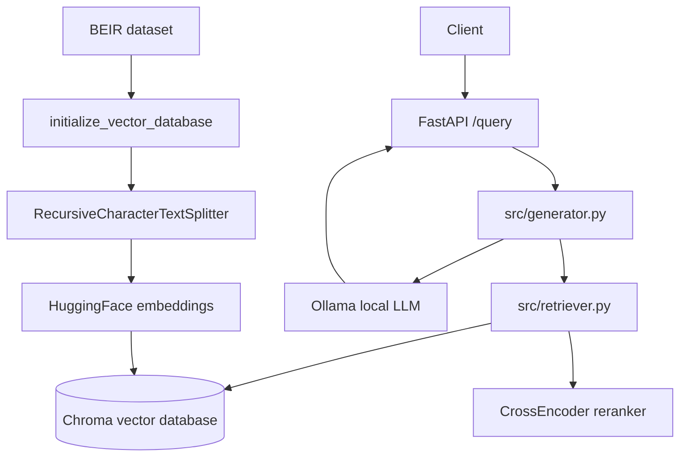

# RAG Web App

This is a RAG web app that exposes a query API with FastAPI. The system builds a Chroma vector database from a BEIR dataset, retrieves relevant documents for each query, formats the retrieved context into a prompt, and uses Ollama to call a local LLM for answer generation.

## Architecture Overview



## Main Modules

- `main.py`: FastAPI app entry point. It configures logging and ensures the vector database is initialized during the lifespan startup phase.
- `src/routes.py`: API route definitions. It currently provides `GET /health` and `POST /query`.
- `src/generator.py`: RAG generation flow. It gets the retriever, builds the prompt, and calls `GENERATE_MODEL` through Ollama.
- `src/retriever.py`: Retrieval core. It builds the Chroma vector store, runs vector search, supports BM25 hybrid retrieval, and applies CrossEncoder reranking.
- `test/evaluation.py`: Retriever evaluation with BEIR qrels, including initial retrieval and reranked retrieval metrics.
- `src/config.py`: Central configuration for the dataset, embedding model, reranker model, Ollama URL, generation model, and retriever type.
- `docker-compose.yml`: Starts the Ollama container and mounts `./ollama` to persist model data.
- `Makefile`: Common development commands for installation, formatting, linting, CI checks, and starting the API server.

## Query Flow

1. The user calls `POST /query` with a `query` field in the request body.
2. `src/routes.py` calls `generate_response(query)`.
3. `src/generator.py` ensures `vectordatabase/` is initialized and gets the cached retriever.
4. The retriever fetches candidate chunks from Chroma.
5. The `CrossEncoder` reranker reorders the candidate chunks and keeps the top documents.
6. The generator combines the query and retrieved documents into a prompt.
7. Ollama uses `GENERATE_MODEL` to produce the final answer.

## Vector Database Initialization

`initialize_vector_database()` runs when `vectordatabase/` does not exist or is empty:

1. Download the BEIR dataset from `DATASET_URL`.
2. Read `corpus.jsonl`.
3. Combine each title and text field into a LangChain `Document`.
4. Split documents into chunks with `RecursiveCharacterTextSplitter`.
5. Generate embeddings with `EMBEDDING_MODEL`.
6. Write chunks to Chroma with cosine distance.

If the embedding model or embedding dimension changes, delete or rebuild `vectordatabase/`. Chroma collections require a consistent vector dimension.

## Retriever Types

Two retriever types are currently supported:

- `vector`: Uses Chroma vector search only.
- `hybrid`: Combines Chroma vector search with BM25 and merges ranked results through `EnsembleRetriever`.

Configure this with `RETRIEVER_TYPE` in `src/config.py`.

## Running the App

### Install dependencies

```bash
make install
```

### Start Ollama

```bash
docker compose up -d ollama
```

> **Note:** `docker-compose.yml` reserves an NVIDIA GPU by default. If you do not have a GPU, remove or comment out the `deploy:` block before starting the container.

### 3. Pull the generation model

The app uses `GENERATE_MODEL` from `src/config.py` (default `llama3.1`). Pull it into the Ollama container before the first query:

```bash
docker exec -it ollama ollama pull llama3.1
```

### 4. Start the FastAPI app

```bash
make run
```

> On the first run, the lifespan startup builds the vector database when `vectordatabase/` is missing or empty: it downloads the BEIR dataset, generates embeddings, and writes them to Chroma. This can take a while.

By default, the API server runs at:

```text
http://localhost:8000
```

Health check:

```bash
curl http://localhost:8000/health
```

Query API:

```bash
curl -X POST http://localhost:8000/query \
	-H "Content-Type: application/json" \
	-d '{"query":"Living Longer by Reducing Leucine Intake"}'
```

## Evaluation

Run retriever evaluation:

```bash
make evaluate
```

By default this runs the `hybrid` retriever on the `dev` split with the embedding truncate dimension from `config.py` (`512`). Override the retriever, split, or dimension with variables:

```bash
make evaluate RETRIEVER=vector SPLIT=test DIM=256
```

`DIM` sets `EMBED_TRUNCATE_DIM` for the run, so the vector database must have been built at the same dimension — otherwise the dimension pre-check raises a mismatch error and you need to rebuild `vectordatabase/` first with `rm -rf vectordatabase/ && make run`.

Or invoke the module directly:

```bash
EMBED_TRUNCATE_DIM=256 uv run python -m test.evaluation --retriever hybrid --split dev
```

At the end of a run the evaluation also reports the embedding dimension used and the initial-retrieval and reranking timings (total and per-query).

Available retrievers:

- `hybrid`
- `vector`

Available splits:

- `train`
- `dev`
- `test`

Evaluation logs are written to `log/`.
